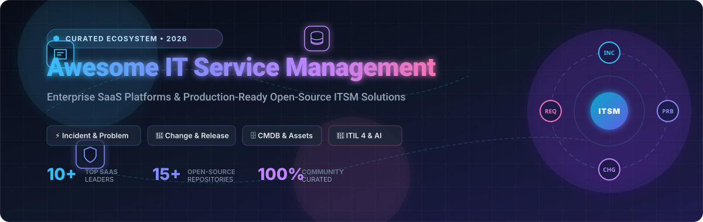

<div align="center">

<a href="https://github.com/ishandutta2007/Awesome-IT-Service-Management">
  
</a>

# 🚀 Awesome IT Service Management (ITSM)

<p align="center">
  <strong>A curated list of leading Enterprise SaaS platforms &amp; production-ready Open-Source IT Service Management (ITSM) solutions.</strong><br>
  <em>Covering Incident, Problem, Change, Request Fulfillment, CMDB, Asset Management (ITAM), Service Catalogs, and ITIL 4 Workflows.</em>
</p>

<p align="center">
  <a href="https://github.com/ishandutta2007/Awesome-Awesome-Awesome"></a>
  <a href="https://discord.gg/jc4xtF58Ve"></a>
  <a href="https://github.com/ishandutta2007/Awesome-IT-Service-Management/stargazers"></a>
  <a href="https://github.com/ishandutta2007/Awesome-IT-Service-Management/network/members"></a>
  <a href="https://github.com/ishandutta2007/Awesome-IT-Service-Management/pulls"></a>
  <a href="LICENSE"></a>
  <a href="https://github.com/ishandutta2007"></a>
</p>

</div>

---

## 📌 Table of Contents

- [🌟 Overview &amp; Key Concepts](#-overview--key-concepts)
- [☁️ SaaS &amp; Hosted ITSM Platforms](#️-saas--hosted-itsm-platforms)
- [💻 Open-Source ITSM &amp; Service Desk Projects](#-open-source-itsm--service-desk-projects)
- [🧩 ITSM Architecture &amp; ITIL Frameworks](#-itsm-architecture--itil-frameworks)
- [📊 Evaluation Criteria: SaaS vs Open-Source](#-evaluation-criteria-saas-vs-open-source)
- [🤝 How to Contribute](#-how-to-contribute)
- [📈 Star History](#-star-history)
- [⚖️ Disclaimer](#️-disclaimer)

---

## 🌟 Overview & Key Concepts

**IT Service Management (ITSM)** defines the policies, processes, and supporting software utilized by modern enterprise IT teams to design, deliver, manage, and optimize the lifecycle of information technology services.

Aligned with frameworks such as **ITIL 4**, **COBIT**, and **DevOps / SRE**, modern ITSM ecosystems bridge communication between internal business units, service desks, and engineering teams through:

* 🚨 **Incident & Major Incident Management**: Rapid triage, escalation routing, and MTTR reduction.
* 🔍 **Problem Management**: Root-cause analysis (RCA), known error databases (KEDB), and recurrence prevention.
* 🔄 **Change Enablement & Release Management**: Change advisory boards (CAB), automated risk evaluation, and CI/CD pipelines.
* 🗄️ **Configuration Management Database (CMDB) & ITAM**: Asset lifecycle tracking, hardware/software inventories, and dependency mapping.
* 📚 **Knowledge Management & Self-Service Portals**: Deflecting repetitive inquiries with AI virtual agents and centralized guides.
* ⏱️ **Service Level Agreement (SLA) Tracking**: Multi-tier priority queues, response/resolution milestones, and automated escalations.

---

## ☁️ SaaS & Hosted ITSM Platforms

> 📊 **Market Size & Structure Analysis**: The global IT Service Management (ITSM) software market is estimated at **~$14.85B – $17.4B in 2026** and projected to reach **$30B+ by the early 2030s** at a compound annual growth rate (**CAGR of ~13–16%**). The market structure is **moderately concentrated at the high-end yet fragmented across the mid-market**: top-tier enterprise vendors (ServiceNow, Atlassian, BMC) command nearly 45–50% of aggregate revenue, while agile, AI-native challengers (Freshservice, HaloITSM, ManageEngine, SysAid) vigorously compete across mid-tier, regional, and vertical niches rather than creating a pure winner-take-all monopoly.

The table below details leading commercial SaaS ITSM platforms, sorted in descending order of **Company Size (Valuation / Market Cap / Revenue)**:

| 🏷️ Product | 🏢 Company Size &amp; Valuation | 📝 Description | 💳 Pricing (Starting Tier) | 🎁 Free Tier / Free Trial Limits |
| :--- | :--- | :--- | :--- | :--- |
| **[ServiceNow](https://www.servicenow.com/)** | **~$146B+ Market Cap**<br>*(~$14.5B Annual Revenue; NYSE: NOW)* | Industry-standard enterprise ITSM powerhouse featuring full ITIL 4 alignment, extensive CMDB federation, automated workflow orchestration, and generative AI (Now Assist). | ~$70 – $100 / user / month *(ITSM Fulfiller seat; custom enterprise quote)* | **Free Personal Developer Instance (PDI)** for sandbox learning &amp; development (full platform capability; hibernates after inactivity); 30-day enterprise POC on request |
| **[Jira Service Management](https://www.atlassian.com/software/jira/service-management)** | **~$48B+ Market Cap**<br>*(~$5.2B Annual Revenue; NASDAQ: TEAM)* | High-velocity ITSM suite seamlessly unified with Jira and Confluence, ideal for engineering-led organizations, DevOps teams, and agile service management. | **$20 / agent / month** *(Standard tier, monthly)* or **$17.60 / agent / month** *(billed annually)* | **Free Forever Plan**: Up to 3 agents, 2 GB file storage, 500 automation runs/month, 100 email notifications/day (also offers 7-day trial for Standard &amp; Premium tiers) |
| **[ManageEngine ServiceDesk Plus](https://www.manageengine.com/products/service-desk/)** | **~$12.5B+ Valuation**<br>*(~$1.5B Annual Revenue; Zoho Corporation)* | Cost-effective and comprehensive ITSM suite bundling help desk ticketing, asset management, ITIL workflows, and CMDB integration. | **$13 / technician / month** *(Standard Cloud, billed annually)* or **$16 / technician / month** *(monthly billing)* | **Free Forever Edition**: Up to 5 technicians with unlimited requesters/end-users (Standard Edition); 30-day free trial of full Cloud editions |
| **[BMC Helix](https://www.bmc.com/it-solutions/bmc-helix.html)** | **~$8.5B+ Valuation**<br>*(~$2.3B Annual Revenue; BMC Software / KKR)* | Enterprise-grade ITSM and AIOps cloud platform built for multi-cloud governance, predictive service resolution, and large-scale complex workflows. | ~$115 – $320 / named user / month *(Enterprise ITSM suite; custom quote-based annual contract)* | **30-day guided POC / evaluation instance**: Full access to configured enterprise environment upon sales evaluation approval |
| **[Freshservice](https://www.freshworks.com/freshservice/)** | **~$3.5B+ Market Cap**<br>*(~$838M Annual Revenue; NASDAQ: FRSH)* | Modern, user-friendly ITSM platform designed for mid-market to enterprise agility with intuitive self-service, asset discovery, and AI service bot capabilities (Freddy AI). | **$19 / agent / month** *(Starter plan, billed annually)* or **$29 / agent / month** *(monthly billing)* | **14-day free trial**: Unrestricted access to Enterprise-level features, up to 100 requesters, unlimited tickets, no credit card required |
| **[HaloITSM](https://haloitsm.com/)** | **~$2.0B Valuation**<br>*(~$100M Annual Revenue; Halo Service Solutions)* | Rapidly emerging, highly configurable all-inclusive ITSM solution delivering ITIL-aligned modules, asset tracking, and service catalogs with transparent operations. | **$49 – $70 / agent / month** *(scales with team size; starting at $99/agent/mo for small teams; all core modules included)* | **30-day free trial**: Full access to all ITIL modules, workflow automation, and self-service portal, no credit card required |
| **[TOPdesk](https://www.topdesk.com/)** | **~€1B+ ($1.1B+) Valuation**<br>*(~$190M Annual Revenue; CVC Growth backed)* | Established European service management leader focused on IT, HR, and Facilities enterprise service management (ESM) with clean interface design. | **€61 (~$66–$76) / agent / month** *(Essential plan, billed annually)* | **30-day free trial**: Full access to operator console, incident &amp; asset management, and self-service portal, no credit card required |
| **[InvGate Service Desk](https://invgate.com/)** | **~$150M – $300M+ Valuation**<br>*(~$30M–$50M Revenue; $35M Series B funding)* | Intuitive service desk and IT asset management suite emphasizing visual workflow automation, employee portal usability, and rapid deployment. | **$25 / agent / month** *($1,499/year fixed for Starter tier up to 5 agents, unlimited requesters)* | **30-day free trial**: Full access to ticketing, asset management, and automation workflows, no credit card required |
| **[EasyVista](https://www.easyvista.com/)** | **~€131M+ ($145M+) Valuation**<br>*(~$85M–$160M Revenue; Eurazeo PE)* | End-to-end service management and remote support suite focusing on codeless workflow automation, proactive IT monitoring, and self-service deflection. | ~$35 – $50 / user / month *(Enterprise core ITSM, quote-based)* / $125 / user / month *(Self Help tier)* | **15-day free trial** for specialized modules (e.g., EV Reach); customized proof-of-concept (POC) and interactive demo on request |
| **[SysAid](https://www.sysaid.com/)** | **~$100M – $200M Valuation**<br>*(~$25M–$37M Revenue; $30M total funding)* | AI-native ITSM platform featuring built-in agentic AI, asset management, automated ticket categorization, and zero-touch resolution workflows. | **$89 / agent / month** *(Professional plan with unlimited AI agent usage)* | **30-day free trial**: Full access to service desk and AI automation features, no credit card required |

---

## 💻 Open-Source ITSM & Service Desk Projects

The open-source ITSM landscape offers robust, self-hostable alternatives spanning full-stack ITIL suites, shared inboxes, and network CMDB tools. 

Entries are sorted in descending order of **GitHub Star Count**:

* 💬 **[Chatwoot](https://github.com/chatwoot/chatwoot)** [](https://github.com/chatwoot/chatwoot/stargazers)  
  Omnichannel customer engagement suite and service desk platform (AGPL v3) supporting live chat, email, social messaging integrations, and collaborative triage queues.

* 🌐 **[NetBox](https://github.com/netbox-community/netbox)** [](https://github.com/netbox-community/netbox/stargazers)  
  Premier open-source network infrastructure source of truth, IPAM, and DCIM suite (Apache 2.0) serving as the authoritative Configuration Management Database (CMDB) core for modern network engineering and infrastructure operations.

* 🎫 **[UVdesk](https://github.com/uvdesk/community-skeleton)** [](https://github.com/uvdesk/community-skeleton/stargazers)  
  Enterprise-grade, extensible open-source helpdesk ticketing system (MIT) built on PHP Symfony with multi-channel support, automated workflows, and custom mailbox integrations.

* 📦 **[Snipe-IT](https://github.com/snipe/snipe-it)** [](https://github.com/snipe/snipe-it/stargazers)  
  Leading open-source IT Asset Management (ITAM) platform (AGPL v3) for tracking hardware lifecycles, software licenses, accessories, and digital consumables with QR/barcode scanning.

* 🏢 **[GLPI](https://github.com/glpi-project/glpi)** [](https://github.com/glpi-project/glpi/stargazers)  
  Comprehensive open-source ITSM and ITAM suite (GPL v3) covering ITIL-aligned incident, problem, and change management, CMDB, financial asset accounting, and knowledge bases in a unified stack.

* 📨 **[Zammad](https://github.com/zammad/zammad)** [](https://github.com/zammad/zammad/stargazers)  
  Modern web-based helpdesk and ticketing platform (AGPL v3) featuring real-time collision detection, multi-channel communication (email, chat, telephone, social), smart auto-assignment, and clean REST APIs.

* 📬 **[FreeScout](https://github.com/freescout-helpdesk/freescout)** [](https://github.com/freescout-helpdesk/freescout/stargazers)  
  Lightweight, privacy-focused open-source helpdesk and shared inbox (AGPL v3) built on Laravel, engineered as a seamless self-hosted alternative to Zendesk and Help Scout.

* 🎯 **[osTicket](https://github.com/osTicket/osTicket)** [](https://github.com/osTicket/osTicket/stargazers)  
  Widely adopted open-source support ticket system (GPL v2) featuring customizable ticket forms, rich text formatting, automated routing rules, and SLA tracking.

* 🍃 **[Peppermint](https://github.com/peppermintenterprise/peppermint)** [](https://github.com/peppermintenterprise/peppermint/stargazers)  
  Lightweight, modern open-source ticket management system (MIT) crafted with Node.js and React, providing a rapid, no-fuss service desk interface.

* 🖥️ **[Ralph](https://github.com/allegro/ralph)** [](https://github.com/allegro/ralph/stargazers)  
  Asset management, Data Center Infrastructure Management (DCIM), and CMDB platform (Apache 2.0) designed for large enterprise server racks, hardware lifecycles, and software license compliance.

* ⚡ **[Trudesk](https://github.com/trudesk/trudesk)** [](https://github.com/trudesk/trudesk/stargazers)  
  Open-source helpdesk solution (Apache 2.0) built with Node.js and MongoDB, providing real-time ticket updates, built-in chat, and performance reporting.

* 🛠️ **[iTop](https://github.com/Combodo/iTop)** [](https://github.com/Combodo/iTop/stargazers)  
  ITIL-aligned open-source ITSM &amp; CMDB system (AGPL v3) delivering detailed configuration item (CI) dependency visualization, incident management, change workflows, and SLA enforcement.

* 🛡️ **[Request Tracker (RT)](https://github.com/bestpractical/rt)** [](https://github.com/bestpractical/rt/stargazers)  
  Industrial-strength, battle-tested ticketing and issue tracking system (GPL v2) used worldwide by NOCs, corporate infrastructure teams, and cybersecurity teams (RTIR).

* 🔄 **[Znuny](https://github.com/znuny/Znuny)** [](https://github.com/znuny/Znuny/stargazers)  
  Actively maintained community fork of OTRS Community Edition (GPL v3), focusing on long-term stability, robust ITIL service delivery, and enterprise ticket automation.

* 🦉 **[OTOBO](https://github.com/RotherOSS/otobo)** [](https://github.com/RotherOSS/otobo/stargazers)  
  Flexible open-source service management suite (GNU GPL) based on OTRS with an updated customer portal, CMDB integration, and customizable process management.

---

## 🧩 ITSM Architecture & ITIL Frameworks

```
                       ┌─────────────────────────────────────┐
                       │     End Users / Employees Portal    │
                       └──────────────────┬──────────────────┘
                                          │ Requests / Incidents
                                          ▼
┌─────────────────────────────────────────────────────────────────────────────────┐
│                           IT Service Desk / Core ITSM                           │
│  ┌───────────────────────┐  ┌──────────────────────┐  ┌──────────────────────┐  │
│  │  Incident Management  │  │  Problem Management  │  │  Change Management   │  │
│  │ (Triage, Escalation)  │  │ (RCA, Known Errors)  │  │   (CAB, Risk Assessment) │  │
│  └───────────┬───────────┘  └──────────┬───────────┘  └──────────┬───────────┘  │
│              │                         │                         │              │
│              └─────────────────────────┼─────────────────────────┘              │
│                                        ▼                                        │
│                 ┌─────────────────────────────────────────────┐                 │
│                 │      Configuration Management (CMDB)        │                 │
│                 │   (CI Dependencies, Assets, Software)       │                 │
│                 └─────────────────────────────────────────────┘                 │
└────────────────────────────────────────┬────────────────────────────────────────┘
                                         │ Actionable Metrics
                                         ▼
                       ┌─────────────────────────────────────┐
                       │   SLA Reports & Continuous Service  │
                       │             Improvement             │
                       └─────────────────────────────────────┘
```

---

## 📊 Evaluation Criteria: SaaS vs Open-Source

| Metric / Dimension | ☁️ Commercial SaaS (e.g. ServiceNow, Jira, Freshservice) | 💻 Self-Hosted Open Source (e.g. GLPI, iTop, Zammad) |
| :--- | :--- | :--- |
| **Deployment Time** | ⚡ Instant cloud provisioning; weeks to months for enterprise customizations | ⏱️ Hours for basic server setup; weeks for database configuration &amp; hardening |
| **Upfront Cost** | 💲 Low initial infrastructure; predictable recurring per-agent subscriptions | 🆓 Free open-source software license; requires server hosting &amp; DevOps labor |
| **Customizability** | 🔧 Configuration via visual builders, APIs, and proprietary scripting (e.g. ServiceNow JS) | 💻 Complete control over source code, database schemas, and on-premise hooks |
| **Maintenance &amp; Upgrades**| 🛡️ Managed entirely by the vendor (automatic patching, backups, 99.9%+ SLA) | 🛠️ Managed in-house (backup strategies, high availability, OS &amp; security patches) |
| **Data Sovereignty &amp; Privacy** | 🌐 Subject to vendor cloud regions, SOC2/HIPAA agreements, and shared multi-tenancy | 🔒 Total data residency control on air-gapped or private cloud infrastructure |
| **AI Integration** | 🤖 Built-in out-of-the-box (Now Assist, Freddy AI, Atlassian Intelligence) | 🔌 Requires custom integrations with local LLMs (Ollama) or external APIs |

---

## 🤝 How to Contribute

We welcome contributions from IT service managers, DevOps engineers, and platform maintainers!

1. 🍴 **Fork the repository** on GitHub.
2. 🌿 **Create a feature branch**: `git checkout -b feature/add-itsm-platform`.
3. 📝 **Add or update entries** following the established format:
   * SaaS: Product name, official link, company valuation/revenue, concise description, specific starting price, and exact free tier/trial limits.
   * Open Source: Repository name, star badge, link to stargazers, and 1–2 factual sentences.
4. 🚀 **Commit your changes**: `git commit -m 'Add [Platform Name] to ITSM list'`.
5. 📤 **Push to your branch**: `git push origin feature/add-itsm-platform`.
6. 🎯 **Open a Pull Request** with a brief summary of the contribution.

---

## 📈 Star History

[](https://star-history.dera.page/#ishandutta2007/Awesome-IT-Service-Management&type=date&legend=top-left)

---

## ⚖️ Disclaimer

* This repository is a **community-curated index** created for educational, research, and technical comparison purposes. It does not constitute formal procurement, security, or legal advice.
* Product names, logos, trademarks, and registered trademarks are the property of their respective owners.
* Pricing and feature limits fluctuate over time; always confirm the latest details on official vendor websites before making purchasing decisions.

---

<div align="center">
  <sub>Maintained with ❤️ for IT Service Managers, System Administrators, and DevOps Engineers.</sub>
</div>
